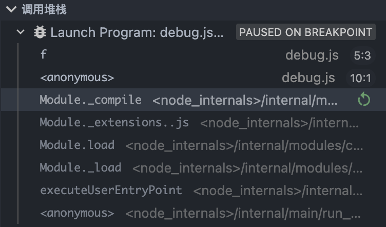

# ES6 新增语法

## 变量声明

### let

`let` 语句声明一个块级作用域的本地变量，并且可选的将其初始化为一个值。它具有如下的特性

#### 不允许重复声明

`var` 可以多次重复声明（最后一次声明会覆盖前面的声明），而 `let` 不能（会报错），可以避免重复命名

```javascript
let a = 1;
let a = 2;

console.log(a); // Uncaught SyntaxError: Identifier 'a' has already been declared
```

这个特性有一大好处就是避免多人开发时，自己或者别人命名了相同名称的变量，把以前的变量给覆盖掉了。

```javascript
var a = 1;
var a = 2;

console.log(a); // 2
```

#### 块级作用域

为什么需要块级作用域？

ES5 时只有全局作用域和函数作用域，没有块级作用域，这带来很多不合理的场景。

- **第一种场景，内层变量可能会覆盖外层变量。**

```javascript
var tmp = new Date();

function f() {
  console.log(tmp);
  if (false) {
    var tmp = 'hello world'; // 这里会有变量提升
  }
}
f(); // undefined
```

if代码块的外部使用外层的tmp变量，内部使用内层的tmp变量。但是，函数f执行后，输出结果为undefined，原因在于变量提升，导致内层的tmp变量覆盖了外层的tmp变量。

变量提升即 js 在解释执行前会将所有 var 类型变量申明提升到作用域顶部，提升后的代码如下：

```javascript
var tmp = new Date();

function f() {
  var tmp; // 变量提升到了函数 f 的作用域顶部
  console.log(tmp);
  if (false) {
    tmp = 'hello world'; // 这里会有变量提升
  }
}
f(); // undefined
```

这里debug 时可以看到有两个作用域，一个是函数 f 的作用域，还有一个是全局的匿名作用域。



- **第二种场景，用来计数的循环变量泄露为全局变量。**

```javascript
var s = 'hello';
for (var i = 0; i < s.length; i++) {
  console.log(s[i]);
}
// for循环外面打印
console.log(i); // 5
```

上面代码中，变量i只用来控制循环，但是循环结束后，它并没有消失，泄露成了全局变量。

由于没有块级作用域，var 声明的变量 i 被提升到全局作用域顶部。

#### es6 的块级作用域

```javascript
{
  let a = 10;
  var b = 1;
}
console.log(b); // 1
console.log(a); // Uncaught ReferenceError: a is not defined
```

let 实际上为 JavaScript 新增了块级作用域，let 声明的变量只在它所在的代码块有效，外层拿不到 let 声明的变量。上面代码中{}就是块级作用域

**ES6 允许块级作用域的任意嵌套。**

```javascript
{{{{
  {let insane = 'Hello World'}
  console.log(insane); // 报错
}}}};
```

上面代码使用了一个五层的块级作用域，每一层都是一个单独的作用域。第四层作用域无法读取第五层作用域的内部变量。

内层作用域可以定义外层作用域的同名变量。

```javascript
{{{{
  let insane = 'Hello World';
  {let insane = 'Hello World'}
}}}};
```

`for`循环的计数器，就很合适使用`let`命令。

```javascript
for (let i = 0; i < 10; i++) {
  // ...
}
console.log(i); // ReferenceError: i is not defined
```

上面代码中，计数器`i`只在`for`循环体内有效，在循环体外引用就会报错。

改成 var 声明的话

```javascript
for (var i = 0; i < 3; i++) {
  console.log(i); //输出0 1 2
}
console.log(i); //会输出3
```

如果想要更加深入的研究 for 循环作用域的问题，请参考这篇 [文章](https://juejin.cn/post/6844903470466629640)

#### 暂时性死区

```javascript
var a = 1
{
 a = 6
 let a  // Uncaught ReferenceError: Cannot access 'a' before initialization
}
```

在代码块内，使用`let`命令声明变量之前，该变量都是不可用的。这在语法上，称为`暂时性死区` ES6 规定暂时性死区，主要是为了减少运行时错误，防止在变量声明前就使用这个变量，从而导致意料之外的行为。这样的错误在 ES5 是很常见的，现在有了这种规定，避免此类错误就很容易了。

#### 变量提升

关于是否有变量提升，目前来看并不统一。阮一峰的 [ECMAScript 6 入门](https://link.juejin.cn?target=https://es6.ruanyifeng.com/)中的 let 和 const 章节中明确说明 `不存在变量提升`。但自己的理解还是存在变量提升的。下面举例说明一下:

```javascript
var a = 1;
 (function () {
   console.log(a); // 1
 })();
```

我们简单改造一下

```javascript
var a = 1;
 (function () {
   console.log(a); // Uncaught ReferenceError: Cannot access 'a' before initialization
   let a = 2
 })();
```

从这里其实可以看出 let 也是存在`变量提升`的，只是在变量赋值之前不能对变量进行读写，否则就会报错，这也就是`暂时性死区`。

#### 变量不会挂载到 window

在本人看来，var 声明的变量挂载到 window 是一种很不好的设计，这很容易会导致变量被污染，以及全局变量被滥用。所以，新的声明方式已经不将声明的变量再挂载到 window 上面了。

```javascript
// var声明的变量会挂载到window上
var a = 1;
window.a // 1

// let声明的变量不会挂载到window
let b = 1;
window.b // undefined
```

顶层对象的属性与全局变量挂钩，被认为是 JavaScript 语言最大的设计败笔之一。这样的设计带来了几个很大的问题，首先是没法在编译时就报出变量未声明的错误，只有运行时才能知道（因为全局变量可能是顶层对象的属性创造的，而属性的创造是动态的）；其次，程序员很容易不知不觉地就创建了全局变量（比如打字出错）；最后，顶层对象的属性是到处可以读写的，这非常不利于模块化编程。另一方面，`window`对象有实体含义，指的是浏览器的窗口对象，顶层对象是一个有实体含义的对象，也是不合适的。

从 ES6 开始，全局变量将逐步与顶层对象的属性脱钩。

### Const

`const`声明一个只读的常量。一旦声明，常量的值就不能改变。**其他特性和 let 一样**。

```javascript
const a = 1;
a = 3;
```

`const`声明的变量不得改变值，这意味着，`const`一旦声明变量，就必须立即初始化，不能留到以后赋值。

```javascript
const a; // 这样声明会报错

```

`const`实际上保证的并不是变量的值不得改动，而是变量指向的那个内存地址所保存的数据不得改动。对于简单类型的数据（数值、字符串、布尔值），值就保存在变量指向的那个内存地址，因此等同于常量。但对于复合类型的数据（主要是对象和数组），变量指向的内存地址，保存的只是一个指向实际数据的指针，`const`只能保证这个指针是固定的（即总是指向另一个固定的地址），至于它指向的数据结构是不是可变的，就完全不能控制了。因此，将一个对象声明为常量必须非常小心。

```javascript
const a = {};
a.prop = 123;
a = {};
```

我们需要明白一个事实，var 所表现出来的特殊性：比如作用域提升、window 全局对象、没有块级作用域等都是一些历史遗留问题；是 JavaScript 在设计之初的一种**语言缺陷**，在实际工作中，我们可以使用最新的规范来编写，也就是不再使用 var 来定义变量了。

❗ 现代语言中通常会用变量和常量来区分申明的变量是否可以改变。比如 scala、kotlin 中的 var 和 val。只有当我们明确知道一个变量后续会需要被重新赋值时再使用 let。

## 对象的解构

首先我们声明一个对象

```javascript
  const obj = { a: 1, b: 2, c: 3 };

```

传统解构方式

```javascript
const a = obj.a;
const b = obj.b;
const c = obj.c;

```

ES6 中新增的解构方式

```javascript
const { a, b, c } = obj;
```

修改解构变量名称

```javascript
const { a: a1, b: b1, c } = obj;
```

赋默认值

```javascript
const { d = 5 } = obj;
const { e: e1 = 6 } = obj;
```

## 解构复杂对象

```javascript
const metadata = {
  title: "english-title",
  translations: [
    {
      title: "我是深处的title",
    },
  ],
  friend: {
    girlFriend: {
      name: {
        firstName: "chimmy",
      },
    },
  },
};

let {
  title: englishTitle,
  translations: [{ title: localeTitle }],
  friend: {
    girlFriend: {
      name: { firstName },
    },
  },
} = metadata;

```

## 数组的解构

```javascript
var names = ["abc", "cba", "nba"];

let [item1, item2, item3] = names;
console.log(item1, item2, item3);

let [, , itemz] = names;
console.log(itemz);

let [itemx, ...newNames] = names;
console.log(itemx, newNames);

let [itema, itemb, itemc, itemd = "aaa"] = names;
console.log(itemd);

let a = 1;
let b = 3;
[a, b] = [b, a];
console.log(a);
console.log(b);
```

## 函数参数解构

函数的参数也可以使用解构赋值。

```javascript
function add([x, y]) {
  return x + y;
}
add([1, 2]);
```

函数参数的解构也可以使用默认值。

```javascript
function move({ x = 0, y = 0 } = {}) {
  return [x, y];
}
move({ x: 3, y: 8 });
move({ x: 3 });
move({});
move();
```

```javascript
let name = "jimmy"
let age = 18

let obj = {
 name，
 age
}

let obj = {
 name:name，
 age:age
}

let obj2 = {
  bar() {
    console.log(this)
  },
}

let obj2 = {
  bar:function() {
    console.log(this)
  }
}

let obj3 = {}
obj3[name] = "chimmy";
console.log(obj3.jimmy);
```

**展开语法(Spread syntax),** 可以在函数调用/数组构造时, 将数组表达式或者 string 在语法层面展开；还可以在构造字面量对象时, 将对象表达式按 key-value 的方式展开。(字面量一般指 `[1, 2, 3]` 或者 `{name: "mdn"}` 这种简洁的构造方式)

### 示例

```javascript
const names = ["abc", "cba", "nba"];
const info = { name: "why", age: 18 };

function foo(x, y, z) {
  console.log(x, y, z);
}
foo(...names);

const newNames = [...names];
console.log(newNames);
console.log(...[1, 2, 3]);

const obj = { ...info, address: "成都市", ...names };
console.log(obj);
```

**复制数组（浅拷贝）**

数组是复合的数据类型，直接复制的话，只是复制了指向底层数据结构的指针，而不是克隆一个全新的数组。

```javascript
const a1 = [1, 2];
const a2 = a1;
a2[0] = 2;
console.log(a1);
```

```javascript
const a1 = [1, 2];
const a2 = [...a1];
a2[0] = 2;
console.log(a1);
```

**合并数组**

```javascript
const arr1 = ["a", "b"];
const arr2 = ["c"];
const arr3 = ["d", "e"];

arr1.concat(arr2, arr3);

[...arr1, ...arr2, ...arr3];
```

**ES6 之前拼接字符串和其他标识符**

```javascript
const name = "jimmy";
const age = 18;
const height = 1.88;
console.log("my name is " + name + ", age is " + age + ", height is " + height);
```

**ES6 提供的模板字符串**

```javascript
const age = 18;
const height = 1.88;

const message = `my name is ${name}, age is ${age}, height is ${height}`;
console.log(message);

const info = `age double is ${age * 2}`;
console.log(info);

function doubleAge() {
  return age * 2;
}
const info2 = `double age is ${doubleAge()}`;
console.log(info2);
```

## 数组的复制

### 浅拷贝

数组是复合的数据类型（引用数据类型），直接复制的话，只是复制了指向底层数据结构的指针，而不是克隆一个全新的数组。

```javascript
const a1 = [1, 2];
const a2 = a1;
a2[0] = 2;
console.log(a1);
```

```javascript
const a1 = [1, 2];
const a2 = [...a1];
a2[0] = 2;
console.log(a1);
```

### 合并数组

```javascript
const arr1 = ["a", "b"];
const arr2 = ["c"];
const arr3 = ["d", "e"];

arr1.concat(arr2, arr3);

[...arr1, ...arr2, ...arr3];
```

## 字符串模板

ES6 之前拼接字符串和其他标识符

```javascript
const name = "jimmy";
const age = 18;
const height = 1.88;
console.log("my name is " + name + ", age is " + age + ", height is " + height);
```

ES6 提供的模板字符串

```javascript
const age = 18;
const height = 1.88;

const message = `my name is ${name}, age is ${age}, height is ${height}`;
console.log(message);

const info = `age double is ${age * 2}`;
console.log(info);

function doubleAge() {
  return age * 2;
}
const info2 = `double age is ${doubleAge()}`;
console.log(info2);
```

## Object 对象的方法

### is 方法

ES5 比较两个值是否相等，只有两个运算符：相等运算符（`==`）和严格相等运算符（`===`）。它们都有缺点，前者会自动转换数据类型，后者的`NaN`不等于自身，以及`+0`等于`-0`。JavaScript 缺乏一种运算，在所有环境中，只要两个值是一样的，它们就应该相等。

ES6 提出“Same-value equality”（同值相等）算法，用来解决这个问题。`Object.is`就是部署这个算法的新方法。它用来比较两个值是否严格相等，与严格比较运算符（===）的行为基本一致。

```javascript
Object.is("foo", "foo");

Object.is({}, {});
```

不同之处只有两个：一是`+0`不等于`-0`，二是`NaN`等于自身。

```javascript
console.log(NaN === NaN);
console.log(0 === -0);

Object.is(NaN, NaN);
Object.is(+0, -0);
```

### assign 方法

`Object.assign()` 方法用于将所有可枚举属性的值从一个或多个源对象分配到目标对象。它将返回目标对象。

```javascript
const target = { a: 1, b: 2 };
const source = { b: 4, c: 5 };

const returnedTarget = Object.assign(target, source);

console.log(target);
console.log(returnedTarget); // { a: 1, b: 4, c: 5 }

target === returnedTarget
```

**语法**

```javascript
Object.assign(target, ...sources);
```

- `target` 目标对象。
- `sources` 源对象。 个数没有限制

返回值为 `目标对象`

如果只有一个参数，`Object.assign()`会直接返回该参数。

```javascript
const obj = { a: 1 };
Object.assign(obj) === obj;
```

如果该参数不是对象，则会先转成对象，然后返回。

```javascript
typeof Object.assign(2);
```

由于`undefined`和`null`无法转成对象，所以如果它们作为参数，就会报错。

```javascript
Object.assign(undefined);
Object.assign(null);

let obj = { a: 1 };
Object.assign(obj, undefined) === obj;
Object.assign(obj, null) === obj;
```

**常见用途**

1. **为对象添加属性**

```javascript
class Point {
  constructor(x, y) {
    Object.assign(this, { x, y });
  }
}
```

上面方法通过`Object.assign()`方法，将`x`属性和`y`属性添加到`Point`类的对象实例。

1. **为对象添加方法**

```javascript
Object.assign(SomeClass.prototype, {
  someMethod(arg1, arg2) {
    ···
  },
  anotherMethod() {
    ···
  }
});

SomeClass.prototype.someMethod = function (arg1, arg2) {
  ···
};
SomeClass.prototype.anotherMethod = function () {
  ···
};
```

上面代码使用了对象属性的简洁表示法，直接将两个函数放在大括号中，再使用`assign()`方法添加到`SomeClass.prototype`之中。

1. **克隆对象**

```javascript
function clone(origin) {
  return Object.assign({}, origin);
}
```

注意，这种方式是浅拷贝。深拷贝常用lodash库的_.cloneDeep方法或者jQuery.extend()方法。

1. **合并多个对象**

   将多个对象合并到某个对象。

```javascript
const merge = (target, ...sources) => Object.assign(target, ...sources);
```

如果希望合并后返回一个新对象，可以改写上面函数，对一个空对象合并。

```javascript
const merge = (...sources) => Object.assign({}, ...sources);
```

1. **为属性指定默认值**

```javascript
const DEFAULTS = {
  logLevel: 0,
  outputFormat: "html",
};

function processContent(options) {
  options = Object.assign({}, DEFAULTS, options);
  console.log(options);
}
```

上面代码中，`DEFAULTS`对象是默认值，`options`对象是用户提供的参数。`Object.assign()`方法将`DEFAULTS`和`options`合并成一个新对象，如果两者有同名属性，则`options`的属性值会覆盖`DEFAULTS`的属性值。

## 对象的遍历方式（扩展）

如何能够遍历出对象中每个 key 和 value 的值呢？

```javascript
let obj = {
  name: "jimmy",
  age: 18,
  like: "girl",
};
```

主要有以下方式

```javascript
for (let key in obj) {
  console.log(key, obj[key]);
}

Object.keys(obj).forEach((key) => {
  console.log(key, obj[key]);
});

Object.getOwnPropertyNames(obj).forEach((key) => {
  console.log(key, obj[key]);
});

Reflect.ownKeys(obj).forEach((key) => {
  console.log(key, obj[key]);
});
```

## 默认参数

ES6 之前，不能直接为函数的参数指定默认值，只能采用变通的方法。

```javascript
function log(x, y) {
  if (typeof y === "undefined" || typeof y === "null") {
    y = "World";
  }
  console.log(x, y);
}

log("Hello");
log("Hello", "China");
log("Hello", "");
```

当一个函数有很多参数涉及初始化的时候，这样写代码极其丑陋。ES6 允许为函数的参数设置默认值，即直接写在参数定义的后面。

```javascript
function log(x, y = "World") {
  console.log(x, y);
}

log("Hello");
log("Hello", "China");
log("Hello", "");
```

ES6 的写法还有两个好处：首先，阅读代码的人，可以立刻意识到哪些参数是可以省略的，不用查看函数体或文档；其次，有利于将来的代码优化，即使未来的版本在对外接口中，彻底拿掉这个参数，也不会导致以前的代码无法运行。

## 变长参数

ES6 引入 rest 参数（形式为`...变量名`），用于获取函数的多余参数，这样就不需要使用`arguments`对象了。rest 参数搭配的变量是一个数组，该变量将多余的参数放入数组中。

```javascript
function add(...values) {
  let sum = 0;

  for (var val of values) {
    sum += val;
  }

  return sum;
}

add(2, 5, 3);
```

上面代码的`add`函数是一个求和函数，利用 rest 参数，可以向该函数传入任意数目的参数。

下面是一个 rest 参数代替`arguments`变量的例子。

```javascript
function sortNumbers() {
  return Array.from(arguments).sort();
}

const sortNumbers = (...numbers) => numbers.sort();
```

上面代码的两种写法，比较后可以发现，rest 参数的写法更自然也更简洁。

注意，rest 参数之后不能再有其他参数（即只能是最后一个参数），否则会报错。

```javascript
function f(a, ...b, c) { // 这么写会报错

}
```

## 箭头函数

箭头函数可以说是 ES6 很大的福利了，不管你是函数式爱好者还是面向对象开发者，函数是必须要用到的东西。之前声明函数需要使用 function，如下：

```javascript
function hello() {
  console.log("say hello");
}

let hello = function () {
  console.log("say hello");
};
```

现在可以这样做了：

```javascript
let hello = () => {
  console.log("say hello");
};
```

如果带参数该怎么做呢？

```javascript
let hello = (name) => {
  console.log("say hello", name);
};

let hello = (name) => {
  console.log("say hello", name);
};
```

函数的声明和参数写的很清楚了，那么对于返回值有什么要注意的地方呢？

**如果返回值是表达式可以省略 return 和 {}**

```javascript
let pow = (x) => x * x;
```

**如果返回值是字面量对象**

```javascript
let person = (name) => ({
  age: 20,
  addr: "Beijing City",
});
```

**箭头函数注意点**

- 箭头函数中没有 this，内部的`this`就是定义时上层作用域中的`this`。也就是说，箭头函数内部的`this`指向是固定的
- 不可以当作构造函数，也就是说，不可以对箭头函数使用`new`命令，否则会抛出一个错误。
- 箭头函数不可以使用 arguments 对象，该对象在函数体内不存在。如果要用，可以用 rest 参数代替。
- 不可以使用`yield`命令，因此箭头函数不能用作 Generator 函数。

## 函数的 length 属性

在函数体内，有时候需要判断函数有几个参数，一共有 2 个办法。在 ES5 中可以在函数体内使用 arguments 来判断。

```javascript
function foo(a, b = 1, c) {
  console.log(arguments.length);
}
foo("a", "b");
```

然而在 ES6 中不能再使用 arguments 来判断了，但可以借助 Function.length 来判断。

```javascript
function foo(a, b = 1, c) {
  console.log(foo.length);
}
foo("a", "b");
```

细心的同学发现 Function.length 结果和 arguments 的结果不同！没错，Function.length 是统计第一个默认参数前面的变量数：

**函数指定了默认值以后，函数的 length 属性，将返回没有指定默认值的参数个数。**

## Array.from

**介绍**

`Array.from`方法用于将两类对象转为真正的数组：类似数组的对象（array-like object）和可遍历（iterable）的对象（包括 ES6 新增的数据结构 Set 和 Map）。

**语法**

```javascript
Array.from(arrayLike[, mapFn[, thisArg]])
复制代码
```

- arrayLike 想要转换成数组的伪数组对象或可迭代对象。
- mapFn 可选 如果指定了该参数，新数组中的每个元素会执行该回调函数。
- thisArg 可选 执行回调函数 mapFn 时 this 对象

下面是一个类似数组的对象，`Array.from`将它转为真正的数组。

```javascript
let arrayLike = {
  "0": "a",
  "1": "b",
  "2": "c",
  length: 3,
};

var arr1 = [].slice.call(arrayLike);

let arr2 = Array.from(arrayLike);
```

实际应用中，常见的类似数组的对象是 DOM 操作返回的 NodeList 集合，以及函数内部的`arguments`对象。`Array.from`都可以将它们转为真正的数组。

```javascript
let ps = document.querySelectorAll("p");
Array.from(ps).filter((p) => {
  return p.textContent.length > 100;
});

function foo() {
  var args = Array.from(arguments);
}

const set = new Set(["foo", "bar", "baz", "foo"]);
Array.from(set);

const map = new Map([
  [1, 2],
  [2, 4],
  [4, 8],
]);
Array.from(map);
```

如果参数是一个真正的数组，`Array.from`会返回一个一模一样的新数组。

```javascript
Array.from([1, 2, 3]);
```

`Array.from`可以接受第二个参数，作用类似于数组的`map`方法，用来对每个元素进行处理，将处理后的值放入返回的数组。

```javascript
Array.from(arrayLike, (x) => x * x);

Array.from(arrayLike).map((x) => x * x);

Array.from([1, 2, 3], (x) => x * x);
```

## for...of

ES6 中新增的数组遍历方式

```javascript
for (let val of [1, 2, 3]) {
  console.log(val);
}
```

## Array.prototype.find()

**介绍**

find() 方法返回数组中满足提供的测试函数的第一个元素的值，否则返回 undefined。

```javascript
const array1 = [5, 12, 8, 130, 44];
const found = array1.find((element) => element > 10);
console.log(found);
```

**语法**

```javascript
arr.find(callback[, thisArg])
复制代码
```

callback 在数组每一项上执行的函数，接收 3 个参数：

```javascript
element当前遍历到的元素。

index 可选 当前遍历到的索引

array 数组本身
复制代码
```

thisArg 执行回调时用作`this` 的对象。

## Array.prototype.findIndex()

findIndex()方法返回数组中满足提供的测试函数的第一个元素的索引。否则返回-1。其实这个和 find() 是成对的，不同的是它返回的是索引而不是值。

```javascript
let array = [5, 12, 8, 130, 44];
let found = array.find(function (element) {
  return element > 10;
});
console.log(found);
```

## Array.prototype.fill()

**介绍**

`fill()` 方法用一个固定值填充一个数组中从起始索引到终止索引内的全部元素。不包括终止索引。

**语法**

```javascript
arr.fill(value[, start[, end]])
```

value 用来填充数组元素的值 start 可选 起始索引 默认值为 0 end 可选 终止索引 默认值为 this.length 返回值 修改后的数组

如果 `start` 是个负数, 则开始索引会被自动计算成为 `length+start`, 其中 `length` 是 `this` 对象的 `length`属性值。如果 `end` 是个负数, 则结束索引会被自动计算成为 `length+end`。

```javascript
const array1 = [1, 2, 3, 4];
console.log(array1.fill(0, 2, 4));
console.log(array1.fill(5, 1));

console.log(array1.fill(6));
```

## Array.prototype.copyWithin()

数组实例的`copyWithin()`方法，在当前数组内部，将指定位置的成员复制到其他位置（会覆盖原有成员），然后返回当前数组。也就是说，使用这个方法，会修改当前数组。

```javascript
Array.prototype.copyWithin(target, start = 0, end = this.length)
复制代码
```

它接受三个参数。

- target（必需）：从该位置开始替换数据。如果为负值，表示倒数。
- start（可选）：从该位置开始读取数据，`默认为 0`。如果为负值，表示从末尾开始计算。
- end（可选）：到该位置前停止读取数据，`默认等于数组长度`。如果为负值，表示从末尾开始计算。

```javascript
[1, 2, 3, 4, 5]
  .copyWithin(0, 3, 4)

  [(1, 2, 3, 4, 5)].copyWithin(0, -2, -1)

  [(1, 2, 3, 4, 5)].copyWithin(-2)
  [(1, 2, 3, 4, 5)].copyWithin(0, 3);
```

## Array.of()

`Array.of()`方法用于将一组值，转换为数组。

```javascript
Array.of(3, 11, 8);
Array.of(3);
Array.of(3).length;
```

这个方法的主要目的，是弥补数组构造函数`Array()`的不足。因为参数个数的不同，会导致`Array()`的行为有差异。

```javascript
Array();
Array(3);
Array(3, 11, 8);
```

面代码中，`Array()`方法没有参数、一个参数、三个参数时，返回的结果都不一样。只有当参数个数不少于 2 个时，`Array()`才会返回由参数组成的新数组。参数只有一个正整数时，实际上是指定数组的长度。

`Array.of()`基本上可以用来替代`Array()`或`new Array()`，并且不存在由于参数不同而导致的重载。它的行为非常统一。

```javascript
Array.of();
Array.of(undefined);
Array.of(1);
Array.of(1, 2);
```

## Number.isFinite()

用来检查一个数值是否为有限的（finite），即不是 Infinity。

```javascript
Number.isFinite(15);
Number.isFinite(0.8);
Number.isFinite(NaN);
Number.isFinite(Infinity);
Number.isFinite(-Infinity);
Number.isFinite("foo");
Number.isFinite("15");
Number.isFinite(true);
```

注意，如果参数类型不是数值，`Number.isFinite`一律返回`false`。

## Number.isNaN()

用来检查一个值是否为 NaN。

```javascript
Number.isNaN(NaN);
Number.isNaN(15);
Number.isNaN("15");
Number.isNaN(true);
Number.isNaN(9 / NaN);
Number.isNaN("true" / 0);
Number.isNaN("true" / "true");
```

如果参数类型不是`NaN`，`Number.isNaN`一律返回`false`。

## Number.isInteger()

用来判断一个数值是否为整数。

```javascript
Number.isInteger(25);
Number.isInteger(25.1);

Number.isInteger();
Number.isInteger(null);
Number.isInteger("15");
Number.isInteger(true);
```

## Number.MAX_SAFE_INTEGER Number.MIN_SAFE_INTEGER

JavaScript 能够准确表示的整数范围在`-2^53`到`2^53`之间（不含两个端点），超过这个范围，无法精确表示这个值。

```javascript
Math.pow(2, 53);

9007199254740992;
9007199254740993;

Math.pow(2, 53) === Math.pow(2, 53) + 1;
```

上面代码中，超出 2 的 53 次方之后，一个数就不精确了。

ES6 引入了`Number.MAX_SAFE_INTEGER`和`Number.MIN_SAFE_INTEGER`这两个常量，用来表示这个范围的上下限。

```javascript
Number.MAX_SAFE_INTEGER === Math.pow(2, 53) - 1;
Number.MAX_SAFE_INTEGER === 9007199254740991;

Number.MIN_SAFE_INTEGER === -Number.MAX_SAFE_INTEGER;
Number.MIN_SAFE_INTEGER === -9007199254740991;
```

## Number.isSafeInteger()

JavaScript 能够准确表示的整数范围在-2^53 到 2^53 之间（不含两个端点），超过这个范围，无法精确表示这个值。

```javascript
Math.pow(2, 53);

Math.pow(2, 53) === Math.pow(2, 53) + 1;
```

## Number.parseInt()，Number.parseFloat()

ES6 将全局方法 parseInt(), parseFloat()移植到 Number 对象上面，行为完全保持不变。这样做的目的，是逐步减少全局性方法，使得语言逐步模块化。

## String.prototype.includes()

ES5 中可以使用 indexOf 方法来判断一个字符串是否包含在另一个字符串中，indexOf 返回出现的下标位置，如果不存在则返回-1。

```javascript
const str = "jimmy";

console.log(str.indexOf("y"));
```

ES6 提供了 includes 方法来判断一个字符串是否包含在另一个字符串中，返回 boolean 类型的值。

```javascript
const str = "jimmy";
console.log(str.includes("mm"));

"Blue Whale".includes("blue");
```

**语法**

```javascript
str.includes(searchString[, position])
复制代码
```

- searchString 要在此字符串中搜索的字符串。
- position 从当前字符串的哪个索引位置开始搜寻子字符串，默认值为 `0`。

`返回值`

如果当前字符串包含被搜寻的字符串，就返回 **`true`**；否则返回 **`false`**。;

## String.prototype.startsWith()

判断参数字符串是否在原字符串的头部, 返回 boolean 类型的值。

```javascript
const str = "jimmy";
console.log(str.startsWith("ji"));
```

## String.prototype.endsWith()

判断参数字符串是否在原字符串的尾部, 返回 boolean 类型的值。

```javascript
const str = "jimmy";

console.log(str.endsWith("my"));
```

## String.prototype.repeat()

repeat 方法返回一个新字符串，表示将原字符串重复 n 次。

```javascript
const str = "jimmy";
const newStr = str.repeat(2);
console.log(newStr);
```

ES6 引入了一种新的原始数据类型 `Symbol` ，表示独一无二的值。它是 JavaScript 语言的第七种数据类型，前六种是：undefined、null、布尔值（Boolean）、字符串（String）、数值（Number）、对象（Object）。

`为什么要引入Symbol呢`

ES5 的对象属性名都是字符串，这容易造成属性名的冲突。比如，你使用了一个他人提供的对象，但又想为这个对象添加新的方法（mixin 模式），新方法的名字就有可能与现有方法产生冲突。如果有一种机制，保证每个属性的名字都是独一无二的就好了，这样就从根本上防止属性名的冲突。这就是 ES6 引入`Symbol`的原因。

Symbol 值通过`Symbol`函数生成。这就是说，对象的属性名现在可以有两种类型，一种是原来就有的字符串，另一种就是新增的 Symbol 类型。凡是属性名属于 Symbol 类型，就都是独一无二的，可以保证不会与其他属性名产生冲突。

```javascript
let a = Symbol();
let b = Symbol();

typeof a;
console.log(a === b);
```

Symbol 函数可以接受一个字符串作为参数，表示对 Symbol 实例的描述，主要是为了在控制台显示，或者转为字符串时，比较容易区分。

```javascript
let s1 = Symbol("foo");
let s2 = Symbol("foo");
console.log(s1);
console.log(s2);

console.log(s1 === s2);
```

**注意**

`Symbol`函数前不能使用`new`命令，否则会报错。这是因为生成的 Symbol 是一个原始类型的值，不是对象。也就是说，由于 Symbol 值不是对象，所以不能添加属性。基本上，它是一种类似于字符串的数据类型。

如果 Symbol 的参数是一个对象，就会调用该对象的`toString`方法，将其转为字符串，然后才生成一个 Symbol 值。

```javascript
const obj = {
  toString() {
    return "abc";
  },
};
const sym = Symbol(obj);
```

`Symbol` 值不能与其他类型的值进行运算，会报错。

```javascript
let sym = Symbol("My symbol");

"your symbol is " + sym`your symbol is ${sym}`;
```

`Symbol` 值可以显式转为字符串,布尔值 但是不能转为数值。

```javascript
let sym = Symbol("My symbol");
String(sym);
sym.toString();

Boolean(sym);
!sym;

Number(sym);
sym + 2;
```

## Symbol.for()

`Symbol.for()` 接受一个字符串作为参数，然后搜索有没有以该参数作为名称的 Symbol 值。如果有，就返回这个 Symbol 值，否则就新建一个以该字符串为名称的 Symbol 值，并将其注册到全局。

```javascript
let s1 = Symbol.for("foo");
let s2 = Symbol.for("foo");
console.log(s1 === s2);
```

Symbol.for()与 Symbol()这两种写法，都会生成新的 Symbol。它们的区别是，前者会被登记在全局环境中供搜索，后者不会。Symbol.for()不会每次调用就返回一个新的 Symbol 类型的值，而是会先检查给定的 key 是否已经存在，如果不存在才会新建一个值。

## Symbol.keyFor()

Symbol.keyFor()方法返回一个已登记的 Symbol 类型值的 key。

```javascript
const s1 = Symbol("foo");
console.log(Symbol.keyFor(s1));

const s2 = Symbol.for("foo");
console.log(Symbol.keyFor(s2));
```

**应用场景**

`消除魔术字符串`

魔术字符串指的是，在代码之中多次出现、与代码形成强耦合的某一个具体的字符串或者数值。风格良好的代码，应该尽量消除魔术字符串，改由含义清晰的变量代替。

```javascript
function getArea(shape, options) {
  let area = 0;

  switch (shape) {
    case "Triangle":
      area = 0.5 * options.width * options.height;
      break;
  }

  return area;
}

getArea("Triangle", { width: 100, height: 100 });
```

上面代码中，字符串 Triangle 和 Circle 就是魔术字符串。它多次出现，与代码形成“强耦合”，不利于将来的修改和维护。

常用的消除魔术字符串的方法，就是把它写成一个变量。

```javascript
const shapeType = {
  triangle: "Triangle",
};

function getArea(shape, options) {
  let area = 0;
  switch (shape) {
    case shapeType.triangle:
      area = 0.5 * options.width * options.height;
      break;
  }
  return area;
}

getArea(shapeType.triangle, { width: 100, height: 100 });
```

上面代码中，我们把`Triangle`写成`shapeType`对象的`triangle`属性，这样就消除了强耦合。

如果仔细分析，可以发现`shapeType.triangle`等于哪个值并不重要，只要确保不会跟其他`shapeType`属性的值冲突即可。因此，这里就很适合改用 Symbol 值。

```javascript
const shapeType = {
  triangle: Symbol(),
};
```

**最终的代码**

```javascript
const shapeType = {
  triangle: Symbol(),
  circle: Symbol(),
};

function getArea(shape) {
  let area = 0;
  switch (shape) {
    case shapeType.triangle:
      area = 0.5 * options.width * options.height;
      break;
    case shapeType.circle:
      break;
  }
  return area;
}
console.log(getArea(shapeType.triangle));
```

`Symbol` 类型还可以用于定义一组常量，保证这组常量的值都是不相等的。

```javascript
const COLOR_RED = Symbol();
const COLOR_GREEN = Symbol();

function getComplement(color) {
  switch (color) {
    case COLOR_RED:
      return COLOR_GREEN;
    case COLOR_GREEN:
      return COLOR_RED;
    default:
      throw new Error("Undefined color");
  }
}
```

常量使用 Symbol 值最大的好处，就是其他任何值都不可能有相同的值了，因此可以保证上面的`switch`语句会按设计的方式工作。

ES6 提供了新的数据结构 Set。它类似于数组，但是成员的值都是唯一的，没有重复的值。

`Set`本身是一个构造函数，用来生成 Set 数据结构。

```javascript
let s = new Set();

let s2 = new Set([1, 2, 3]);
```

## 添加数据

```javascript
let s = new Set();
s.add("chimmy");
s.add("18");
s.add("jimmy").add("18");

console.log(s);
```

## 删除数据

```javascript
s.delete("jimmy");

s.clear();
```

## 查找和总数

```javascript
s.has("hello");

s.size;
```

## 应用场景

### 数组去重

```javascript
let arr = [1, 2, 3, 4, 2, 3];
let s = [...new Set(arr)];
console.log(s);
```

### 合并去重

```javascript
let arr1 = [1, 2, 3, 4];
let arr2 = [2, 3, 4, 5, 6];
let s = new Set([...arr1, ...arr2]);
console.log(s);
console.log([...s]);
console.log(Array.from(s));
```

### 交集

```javascript
let arr1 = [1, 2, 3, 4];
let arr2 = [2, 3, 4, 5, 6];
let s1 = new Set(arr1);
let s2 = new Set(arr2);
let result = new Set(arr1.filter((item) => s2.has(item)));
console.log(Array.from(result));
```

### 差集

```javascript
let arr1 = [1, 2, 3, 4];
let arr2 = [2, 3, 4, 5, 6];
let s1 = new Set([1, 2, 3, 4]);
let s2 = new Set([2, 3, 4, 5, 6]);
let arr3 = new Set(arr1.filter((item) => !s2.has(item)));
let arr4 = new Set(arr2.filter((item) => !s1.has(item)));
console.log(arr3);
console.log(arr4);
console.log([...arr3, ...arr4]);
```

WeakSet 结构与 Set 类似，也是不重复的值的集合。但是，它与 Set 有两个区别。

WeakSet 的成员只能是对象，而不能是其他类型的值。

```javascript
const ws = new WeakSet();
ws.add(1);

ws.add(Symbol());
```

```javascript
let ws = new WeakSet();
const obj1 = {
  name: "imooc",
};
const obj2 = {
  age: 5,
};
ws.add(obj1);
ws.add(obj2);
ws.delete(obj1);
console.log(ws);
console.log(ws.has(obj2));
```

WeakSet 没有 size 属性，没有办法遍历它的成员。

WeakSet 中的对象都是弱引用，即垃圾回收机制不考虑 WeakSet 对该对象的引用，也就是说，如果其他对象都不再引用该对象，那么垃圾回收机制会自动回收该对象所占用的内存，不考虑该对象还存在于 WeakSet 之中。

JavaScript 的对象（Object），本质上是键值对的集合（Hash 结构），但是传统上只能用字符串当作键。这给它的使用带来了很大的限制。

```javascript
const data = {};
const element = document.getElementById("myDiv");

data[element] = "metadata";
data["[object HTMLDivElement]"];
```

上面代码原意是将一个 DOM 节点作为对象`data`的键，但是由于对象只接受字符串作为键名，所以`element`被自动转为字符串`[object HTMLDivElement]`。

为了解决这个问题，ES6 提供了 Map 数据结构。它类似于对象，也是键值对的集合，但是“键”的范围不限于字符串，各种类型的值（包括对象）都可以当作键。也就是说，Object 结构提供了“字符串—值”的对应，Map 结构提供了“值—值”的对应，是一种更完善的 Hash 结构实现。如果你需要“键值对”的数据结构，Map 比 Object 更合适。

```javascript
const m = new Map();
const o = {p: 'Hello World'};

m.set(o, 'content')
m.get(o) // "content"

m.has(o) // true
m.delete(o) // true
m.has(o) // false
复制代码
```

上面代码使用 Map 结构的`set`方法，将对象`o`当作`m`的一个键，然后又使用`get`方法读取这个键，接着使用`delete`方法删除了这个键。

## 添加数据

```javascript
let map = new Map();
let keyObj = {};
let keyFunc = function () {};
let keyString = "a string";

map.set(keyString, "和键'a string'关联的值");
map.set(keyObj, "和键keyObj关联的值");
map.set(keyFunc, "和键keyFunc关联的值");
console.log(map);
```

## 删除数据

```javascript
map.delete(keyObj);

map.clear();
```

## 查找和统计

```javascript
console.log(map.size);

console.log(map.has(keyObj));
```

## 获取

```javascript
console.log(map.get(keyObj));
```

WeakMap 结构与 Map 结构类似，也是用于生成键值对的集合。

```javascript
const wm1 = new WeakMap();
const key = {
  foo: 1,
};
wm1.set(key, 2);
wm1.get(key);

const k1 = [1, 2, 3];
const k2 = [4, 5, 6];
const wm2 = new WeakMap([
  [k1, "foo"],
  [k2, "bar"],
]);
wm2.get(k2);
```

**WeakMap 与 Map 的区别有两点。**

- WeakMap 的键名所指向的对象，不计入垃圾回收机制。
- WeakMap 只接受对象作为键名（null 除外），不接受其他类型的值作为键名。

```javascript
const map = new WeakMap();
map.set(1, 2);

map.set(Symbol(), 2);

map.set(null, 2);
```
