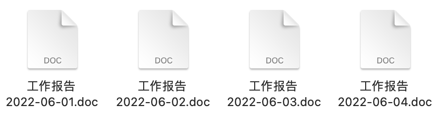
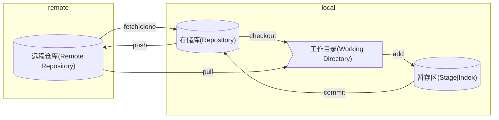

# 简介

Git 是用于追踪任何一组文件中的更改的软件，通常用于协调程序员在软件开发期间协作开发源代码的工作，通常也被称为分布式版本控制系统。

## 相关资源

- [Git 教程 - 廖雪峰](https://www.liaoxuefeng.com/wiki/896043488029600)
- [为你自己学 Git - 高见龙](https://gitbook.tw/)
- [如何参与 Tianchi(天池)项目以及如何贡献代码 - QTCN开发网](http://www.qtcn.org/bbs/simple/?t53628.html)
- [Commit message 和 Change log 编写指南 - 阮一峰](http://www.ruanyifeng.com/blog/2016/01/commit_message_change_log.html)

## 什么叫分布式版本控制

首先什么是**版本控制**，我们平时使用电脑在遇到更新文档是通常会用日期来区分文件的版本就像下图这样



假设你是某公司的员工，老板让你写一份工作报告，但是接连几天都让你回去再修改修改，你为了防止之前的工作内容丢失，然后复制粘贴重命名，一系列操作下来保存了多个版本的工作报告，这就是最原始的版本控制。

所谓**分布式版本控制**就是多人共同写工作报告时，将项目下所有的文件和文件历史在每一位开发者的电脑上镜像备份一份。

## Git 有哪些优势

1. Git 是**免费开源**的。
2. 当你是用日期命名来做版本控制时，并不能一眼就看出各个文件间的差别，Git 提供的文件历史则**可以清晰的看到每个版本间的区别**。
3. 上面的复制粘贴大法很占用磁盘空间，Git 会利用二进制配合压缩来存储文件版本，可以**减少空间占用**。
4. Git 是分布式版本控制系统，方便支持**多人协作开发**。

## Git 的基本概念

Git 里主要分成 Working Directory、Staging Area、Repository 三个区域

| 名称       | 别称               | 描述                                    |
| ---------- | ------------------ | --------------------------------------- |
| 工作目录   | -                  | 即当前本地打开的目录                    |
| 暂存区     | 索引               | 保存了下次将提交的文件列表信息          |
| 存储库     | 版本库、本地版本库 | 隐藏目录 `.git`，用于本地存储提交的记录 |
| 远程存储库 | -                  | 用于接收本地存储库中的提交              |

他们之间完整的关系图如下



<!-- 删除远程分支之后记得执行下面的命令，同步分支状态。

```shell
git fetch -p
``` -->
